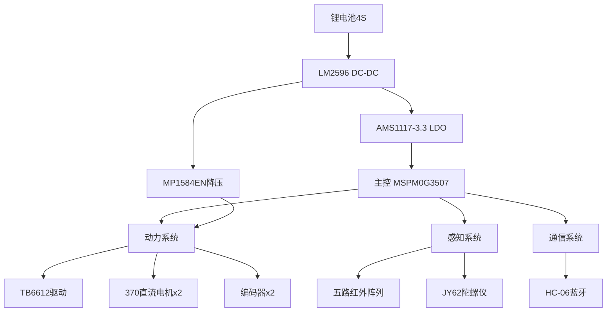

# 2024年小车电赛文档

## 项目概述

本项目是基于嘉立创地猛星（MSPM0G3507）最小系统板的智能巡线小车，旨在完成2024年电赛H题。采用五路红外传感器实现路径识别，通过PID算法进行闭环控制，具备蓝牙通信等功能。

## 小组成员

|姓名      |学号      |
|---------|----------|
|杨家宝    |2024522007|
|刘书航    ||
|杨惠钧    ||

## 一、硬件架构设计

### 1.1 硬件示意图



### 1.2 关键引脚分配表

| 功能模块       | 引脚    | 信号类型 | 连接器件     |
|----------------|---------|----------|--------------|
| **电机驱动**   | A12     | GPIO     | TB6612_STBY  |
|                | B6-B7   | PWM      | TB6612_AIN1-2|
|                | A8-A9   | PWM      | TB6612_BIN1-2|
| **编码器接口** | B24-B20 | QEI      | 左电机编码器 |
|                | A16-A15 | QEI      | 右电机编码器 |
| **红外阵列**   | A23-A27 | GPIO     | TRK1-TRK5    |
| **蓝牙模块**   | A21-A22 | UART     | HC-06        |
| **陀螺仪**     | A28-A31 | I2C      | JY62         |

### 1.3 电源树设计

| 电源模块      | 输入电压 | 输出电压 | 最大电流 | 供电目标         |
|---------------|----------|----------|----------|------------------|
| 锂电池组      | 14.8V    | 12V        | 3A       | 动力系统         |
| LM2596       | 14.8V    | 5V       | 2A       | 控制电路         |
| AMS1117-3.3  | 5V       | 3.3V     | 800mA    | MCU及数字电路    |
| MP1584EN     | 14.8V    | 5V        | 3A       | 红外传感器阵列   |

### 1.4 电路图


## 二、软件架构实现

### 2.1 开发环境

* TI官方提供的*CCS20.1.1*

### 2.1 模块化文件结构

``` markdown
工程根目录/
├── app/                # 应用层模块
│   ├── buzzer/         # 蜂鸣器驱动
│   ├── encoder/        # 编码器接口
│   ├── hc_06/          # 蓝牙通信模块
│   ├── motor/          # 电机控制核心
│   ├── jdy62/          # 姿态传感器
│   ├── tb6612/         # 驱动芯片底层
│   └── tracking/       # 巡线算法实现
│   └── control/        # 逻辑控制代码
├── lib/                # 通用库文件
│   ├── delay/          # 延时函数
│   ├── key/            # 按键检测
│   ├── pid/            # PID算法库
│   ├── task/           # 任务调度器
│   └── uart/           # 串口通信库
└── src/                # 主程序
    ├── main.c          # 系统初始化与主循环

```

## 三、核心算法实现

### 3.1 电机PWM控制

此部分是通过tb6612和PWM信号来驱动电机进行旋转

```c
void SetPWM_R(float duty)
{
    if (duty > 0)
    {
        // 正向旋转
        AIN1_OUT(0);
        AIN2_OUT(1);
    }
    else if (duty < 0)
    {
        // 反向旋转
        duty = -duty;
        AIN1_OUT(1);
        AIN2_OUT(0);
    }
    else
    {
        // 停止
        AIN1_OUT(0);
        AIN2_OUT(0);
    }
    
    // 将占空比转换为定时器的比较值
    uint32_t ccr = duty / 100.0f * 1000;
    // 设置PWM值
    DL_TimerG_setCaptureCompareValue(PWM_R_INST, ccr, GPIO_PWM_R_C0_IDX);
    ···
}
```

### 3.3 PID算法实现

此部分采用了增量式PID算法。

```c
float PID_Compute(PID_Typedef *PIDx, float fb)
{
    PIDx->err = PIDx->sp - fb;  // 计算当前误差
    
    // 增量式PID算法
    PIDx->co += PIDx->kp * (PIDx->err - PIDx->last_err) +
                PIDx->ki * PIDx->err +
                PIDx->kd * (PIDx->err - 2 * PIDx->last_err + PIDx->last2_err);
    
    PIDx->last2_err = PIDx->last_err;  // 更新上上次误差
    PIDx->last_err = PIDx->err;        // 更新上次误差
    
    if(PIDx->co<=0.7&&PIDx->co>=0.7)
    {
        PIDx->co = 0;
    }

    return PIDx->co;
}
···
```

### 3.4 电机进程

此部分差速环作为外环，先通过逻辑判断并计算差速，再传给内环速度环解算出最后传给电机的PWM信号

```c
// motor.c
void Motor_Proc()
{
    float speed_l = target_speed_l;
    float speed_r = target_speed_r;
    if(tracking_flag == 1)
    {
        duty_diff = PID_Compute(&pid_tracking, Tracking_Angle());
        speed_l -= duty_diff;
        speed_r += duty_diff;
    }
    else 
    {
        duty_diff = PID_Compute_dir(&pid_direction, JY62_Get_Yaw());
        speed_l -= duty_diff;
        speed_r += duty_diff;
    }
    
    Motor_Control_L(speed_l);
    Motor_Control_R(speed_r);
}

void Motor_Control_L(float target_speed)
{
    if(IF_SPEED_ZERO(target_speed))
    {
        PID_Reset(&pid_l_speed);
        SetPWM_L(0);
        return;
    }
        omeg_l = Encoder_Get_L_Speed();
        PID_ChangeSP(&pid_l_speed, target_speed);
        duty_l = PID_Compute(&pid_l_speed, omeg_l);
        PID_Limmit(&duty_l, 100.0, -100.0);
        SetPWM_L(duty_l);
}
···
```

### 3.2 红外循迹算法

此部分通过给红外传感器不同的权重，实现差速调节，小车循迹

```c
// tracking.c
void HW_Detect() {
    Tracking_value = 0;
    
    /* 传感器加权策略 */
    if(P1) Tracking_value -= 9;
    if(P2) Tracking_value -= 6;  // 左偏检测
    if(P3) Tracking_value += 0;  // 中心点不参与计算
    if(P4) Tracking_value += 6;  // 右偏检测
    if(P5) Tracking_value += 9;
}
```

### 3.3 陀螺仪数据解算

此部分参考官方文档，对JY62发送的串口消息进行结算，获取实时角度

```c
// jy62.c
uint8_t JY62_CalculateAngles(const uint8_t *rawData, JY62AnglesData *angles)
{
    // 确保数据有效
    if (rawData[0] != 0x55 || rawData[1] != 0x53) {
        return 0;  // 头部不正确
    }
    
    // 提取各字节
    uint8_t RollL = rawData[2];
    uint8_t RollH = rawData[3];
    uint8_t PitchL = rawData[4];
    uint8_t PitchH = rawData[5];
    uint8_t YawL = rawData[6];
    uint8_t YawH = rawData[7];
    uint8_t VL = rawData[8];
    uint8_t VH = rawData[9];
    uint8_t SUM = rawData[10];
    
    // 校验SUM是否正确
    uint8_t calculatedSum = 0x55 + 0x53 + RollH + RollL + PitchH + PitchL + YawH + YawL + VH + VL;
    
    if (calculatedSum != SUM) {
        jy62Debug.checksumErrors++;
        angles->isValid = 0;
        return 0;  // 校验失败
    }
    
    // 处理Roll角度
    int16_t rollRaw = ((uint16_t)RollH << 8) | RollL;
    float rollTemp = (float)rollRaw / 32768.0f * 180.0f;
    angles->roll = (rollTemp > 180.0f) ? (rollTemp - 360.0f) : rollTemp;
    
    // 处理Pitch角度
    int16_t pitchRaw = ((uint16_t)PitchH << 8) | PitchL;
    float pitchTemp = (float)pitchRaw / 32768.0f * 180.0f;
    angles->pitch = (pitchTemp > 180.0f) ? (pitchTemp - 360.0f) : pitchTemp;
    
    // 处理Yaw角度
    int16_t yawRaw = ((uint16_t)YawH << 8) | YawL;
    float yawTemp = (float)yawRaw / 32768.0f * 180.0f;
    angles->yaw = (yawTemp > 180.0f) ? (yawTemp - 360.0f) : yawTemp;
    
    angles->isValid = 1;  // 标记数据有效
    return 1;  // 计算成功
}
```

### 3.4 按键处理

此部分通过按钮的消抖和状态检测，通过回调函数实现执行长按，短按，连击的对应事件

```c
//key.c
void Key_Proc(Key_TypeDef *Key)
{
    uint8_t currentState;
    uint32_t currentTime = get_ticks();

    if (Key->ChangePending)
    {
        // 消抖处理
        if (currentTime - Key->PendingTime >= KEY_SETTLING_TIME)
        {
            currentState = DL_GPIO_readPins(Key->key_port, Key->key_pin) > 0 ? 1 : 0;
            if (currentState != Key->LastState)
            {
                if (currentState == 1) 
                    OnKeyPressed(Key);
                else 
                    OnKeyReleased(Key);
            }
            Key->LastState = currentState;
            Key->ChangePending = 0;
        }
    }
    else 
    {
        currentState = DL_GPIO_readPins(Key->key_port, Key->key_pin) > 0 ? 1 : 0;
        if (currentState != Key->LastState)
        {
            Key->ChangePending = 1;
            Key->PendingTime = currentTime;
        }
    }
    OnKeyEveryPolled(Key, Key->LastState, currentTime);
}

/**
 * @brief 获取按钮当前状态
 * @param Key 按钮结构体指针
 * @return 按钮状态（0：松开，1：按下）
 */
uint8_t Key_GetState(Key_TypeDef *Key)
{
    return Key->LastState;
}

/**
 * @brief 按钮按下事件处理
 * @param Key 按钮结构体指针
 */
static void OnKeyPressed(Key_TypeDef *Key)
{
    Key->LastPressedTime = get_ticks();
    if (Key->key_pressed_cb != 0)
    {
        Key->key_pressed_cb();
    }
}

/**
 * @brief 按钮松开事件处理
 * @param Key 按钮结构体指针
 */
static void OnKeyReleased(Key_TypeDef *Key)
{
    Key->LastReleasedTime = get_ticks();
    if (Key->key_released_cb != 0)
    {
        Key->key_released_cb();
    }
    
    Key->LongPressTicks = 0;
    
    if (Key->LastReleasedTime - Key->LastPressedTime < Key->LongPressThreshold)
    {
        Key->ClickCnt++;
    }
    else
    {
        Key->ClickCnt = 0;
    }
}

/**
 * @brief 按钮轮询处理
 * @param Key 按钮结构体指针
 * @param State 当前按钮状态
 * @param CurrentTime 当前时间
 */
static void OnKeyEveryPolled(Key_TypeDef *Key, uint8_t State, uint32_t CurrentTime)
{
    // 处理长按
    if (Key->LastState == 1)
    {
        if (Key->LongPressTicks == 0)
        {
            if (Key->LastPressedTime != 0 && 
                CurrentTime - Key->LastPressedTime > Key->LongPressThreshold)
            {
                Key->LongPressTicks = 1;
                if (Key->key_long_pressed_cb)
                {
                    Key->key_long_pressed_cb(Key->LongPressTicks);
                }
                Key->LastLongPressTickTime = get_ticks();
            }
        }
        else
        {
            if (CurrentTime - Key->LastLongPressTickTime > Key->LongPressTickInterval)
            {
                Key->LastLongPressTickTime = get_ticks();
                Key->LongPressTicks++;
                if (Key->key_long_pressed_cb)
                {
                    Key->key_long_pressed_cb(Key->LongPressTicks);
                }
            }
        }
    }
    
    // 处理多击
    if (Key->ClickCnt > 0 && Key->LastState == 0 && 
        (get_ticks() - Key->LastReleasedTime) > Key->ClickInterval)
    {
        if (Key->key_clicked_cb)
        {
            Key->key_clicked_cb(Key->ClickCnt);
        }
        Key->ClickCnt = 0;
    }
}
```

### 3.5蜂鸣器控制

此部分通过获取系统时间，PWM控制，使蜂鸣器可以产生不同周期的不同音量的声音信号

```c
//buzzer.c
void Buzzer_Proc()
{
    uint32_t current_tick = get_ticks();
    // 如果未激活，直接返回
    if (!buzzer.is_active) {
        Buzzer_Off();
        return;
    }
    // 计算经过的时间
    uint32_t elapsed = current_tick - buzzer.start_tick;
    // 完成所有重复
    if (buzzer.current_count >= buzzer.repeat_count) {
        buzzer.is_active = 0;
        Buzzer_Off();
        return;
    }
    // 判断当前是鸣叫还是静音状态
    if (elapsed % (buzzer.duration + buzzer.interval) < buzzer.duration) {
        Buzzer_On();
    } else {
        Buzzer_Off();
        
        // 如果一个周期结束，增加重复计数
        if (elapsed % (buzzer.duration + buzzer.interval) == 0) {
            buzzer.current_count++;
        }
    }
}
```

### 3.6编码器速度解算

此部分通过GPIO中断，采用二倍频计数，获取编码器位置，进而通过定时器结算实时速度

```c
//encoder.c
/**
 * @brief 编码器读取中断服务函数
 * 
 * 该函数在定时器中断触发时调用，用于读取和重置编码器计数值
 */
void TIMER_Encoder_Read_INST_IRQHandler(void)
{
    switch (DL_TimerG_getPendingInterrupt(TIMER_Encoder_Read_INST)){
        case DL_TIMER_IIDX_ZERO:
            // 更新速度值并重置计数器
            Encoder_L_VEL = Encoder_L_CNT;
            Encoder_L_CNT = 0;
            Encoder_R_VEL = Encoder_R_CNT;
            Encoder_R_CNT = 0;
            break;
        default:
            break;
    }
}

/**
 * @brief 编码器GPIO中断处理函数
 * 
 * 该函数处理编码器A和B的GPIO中断，更新编码器计数值
 */
void GROUP1_IRQHandler(void)
{
    // 获取左右编码器的中断状态
    Encoder_L_Port = DL_GPIO_getEnabledInterruptStatus(GPIO_Encoder_L_PORT, GPIO_Encoder_L_L_A_PIN | GPIO_Encoder_L_L_B_PIN);
    Encoder_R_Port = DL_GPIO_getEnabledInterruptStatus(GPIO_Encoder_R_PORT, GPIO_Encoder_R_R_A_PIN | GPIO_Encoder_R_R_B_PIN);
    
    /* 处理左编码器 */
    if((Encoder_L_Port & GPIO_Encoder_L_L_A_PIN) == GPIO_Encoder_L_L_A_PIN)
    {
        // 根据B相状态判断旋转方向
        if(!DL_GPIO_readPins(GPIO_Encoder_L_PORT,GPIO_Encoder_L_L_B_PIN))   {Encoder_L_CNT--;Encoder_L_INT--;}
        else                                                                {Encoder_L_CNT++;Encoder_L_INT++;}
    }
    else if((Encoder_L_Port & GPIO_Encoder_L_L_B_PIN) == GPIO_Encoder_L_L_B_PIN)
    {
        // 根据A相状态判断旋转方向
        if(!DL_GPIO_readPins(GPIO_Encoder_L_PORT,GPIO_Encoder_L_L_A_PIN))   {Encoder_L_CNT++;Encoder_L_INT++;}
        else                                                                {Encoder_L_CNT--;Encoder_L_INT--;}
    }
    // 清除左编码器中断标志
    DL_GPIO_clearInterruptStatus(GPIO_Encoder_L_PORT, GPIO_Encoder_L_L_A_PIN|GPIO_Encoder_L_L_B_PIN);

    /* 处理右编码器 */
    if((Encoder_R_Port & GPIO_Encoder_R_R_A_PIN) == GPIO_Encoder_R_R_A_PIN)
    {
        // 根据B相状态判断旋转方向
        if(!DL_GPIO_readPins(GPIO_Encoder_R_PORT,GPIO_Encoder_R_R_B_PIN))    {Encoder_R_CNT--;Encoder_R_INT--;}
        else                                                                {Encoder_R_CNT++;Encoder_R_INT++;}
    }
    else if((Encoder_R_Port & GPIO_Encoder_R_R_B_PIN) == GPIO_Encoder_R_R_B_PIN)
    {
        // 根据A相状态判断旋转方向
        if(!DL_GPIO_readPins(GPIO_Encoder_R_PORT,GPIO_Encoder_R_R_A_PIN))   {Encoder_R_CNT++;Encoder_R_INT++;}
        else                                                                {Encoder_R_CNT--;Encoder_R_INT--;}
    }
    // 清除右编码器中断标志
    DL_GPIO_clearInterruptStatus(GPIO_Encoder_R_PORT, GPIO_Encoder_R_R_A_PIN|GPIO_Encoder_R_R_B_PIN);
}

```

### 3.7任务控制

此部分为此次赛题的核心逻辑控制，并且将不能被打断的电机进程放进定时器中，定时器周期设定的尽量小。

```c
//control.c
void Control_AB(void)
{
    if(state == 0)
    {
        BUZZER_LONG_BEEP;         // 蜂鸣器提示
        tracking_flag = 0;         // 关闭循迹
        Motor_SetSpeed_R(speed);   // 设置右电机速度
        Motor_SetSpeed_L(speed);   // 设置左电机速度
        Motor_direction(0);        // 设置电机方向
        // 检测是否脱离黑线
        if(!(IS_INBLACK()))
        {
            cnt++;
            if(cnt > AB_WHITE_CNT)             
            {
                state = 1;           
                cnt = 0;
                tracking_flag = 0;
                return;
            }
        }
    }
    // 状态1：检测黑线
    else if(state == 1)
    {
        Motor_direction(0);
        if(IS_INBLACK())
        {
            cnt++;
            if(cnt > AB_BLACK_CNT)             // 检测到黑线持续
            {
                BUZZER_LONG_BEEP;
                state = 2;            // 进入状态二
                cnt = 0;
                Motor_SetSpeed_R(0);   // 设置右电机速度
                Motor_SetSpeed_L(0);   // 设置左电机速度
                return;
            }
        }
        else cnt = 0;
    }
}

/**
 * @brief 巡线小车椭圆路径运动控制函数（ABCDA)
 * @details 通过状态机实现小车在两个半圆上连续运动1圈
 * 状态机工作流程：
 * - state 0: 从A运动到B,走0度直线
 * - state 1: 检测到达B点，并回正
 * - state 2：从B巡线到C
 * - state 3: 从C运动到D，走225度直线
 * - state 4: 从D运动到A，在结尾处回正
 */
void Control_ABCD(void)
{
       // 状态0：初始行驶状态
    if(state == 0)
    {
        tracking_flag = 0;         // 关闭循迹
        Motor_SetSpeed_R(speed);   // 设置右电机速度
        Motor_SetSpeed_L(speed);   // 设置左电机速度
        Motor_direction(0);        // 设置电机方向直行
        
        // 检测是否脱离黑线
        if(!(IS_INBLACK()))
        {
            cnt++;
            if(cnt > ABCD_WHITE_CNT)             
            {
                state = 1;           
                cnt = 0;
                tracking_flag = 0;
                return;
            }
        }
        else cnt = 0;
    }
    // 状态1：检测到B点并回正
    else if(state == 1)
    {
        // 类似Task_3中状态1的回正逻辑
        if(IS_INBLACK())
        {
            cnt++;
            if(cnt > ABCD_BLACK_CNT)             
            {
                    
                    BUZZER_LONG_BEEP;   // 进入状态2
                    state = 2;  
                    tracking_flag = 1;             
                    cnt = 0;
                    return;
            }
        }else cnt = 0;
    }
        
    // 状态2：进入循迹模式（从B到C）
    else if (state == 2)
    {
        tracking_flag = 1;
        if(!(IS_INBLACK()))
        {
            cnt++;
            if(cnt > ABCD_WHITE_CNT)             
            {   
                BUZZER_LONG_BEEP;                
                state = 3;           
                tracking_flag = 0;
                cnt = 0;
                return;
            }
        } 
        else cnt = 0;
    }
    // 状态3：从C运动到D
    else if (state == 3)
    {
        
        Motor_direction(178);
        if(IS_INBLACK())
        {
            cnt++;
            if(cnt > ABCD_BLACK_CNT)             
            {
                BUZZER_LONG_BEEP;                
                state = 4;           
                cnt = 0;
                return;
            }
        } 
        else cnt = 0;
    }
    // 状态4：从D运动到A
    else if (state == 4)
    {
        tracking_flag = 1;
        if(!(IS_INBLACK()))
        {
            cnt++;
            if(cnt > ABCD_WHITE_CNT)             
            {
                BUZZER_LONG_BEEP;                
                state = 0;           
                cnt = 0;
                tracking_flag = 0;
                return;
            }
        } 
        else cnt = 0;
    }
}

/**
 * @brief 巡线小车8字路径运动控制函数(ACBDA)
 * @details 通过状态机实现小车在两个半圆上连续运动1圈
 * 状态机工作流程：
 * - state 0: 从A运动到C,走-45度直线
 * - state 1: 检测到达C点，并回正
 * - state 2：从C巡线到B，并在B点回正
 * - state 3: 从B运动到D，走225度直线
 * - state 4: 从D运动到A，在结尾处回正
 */
void Control_ACBD(void)
{// 状态0：初始行驶状态
    if(state == 0)
    {
        if(state == 0)
        {
        tracking_flag = 0;         // 关闭循迹
        Motor_SetSpeed_R(speed);   // 设置右电机速度
        Motor_SetSpeed_L(speed);   // 设置左电机速度
        Motor_direction(0);        // 设置电机方向直行
        }
        // 检测是否脱离黑线
        if(!(IS_INBLACK()))
        {
            cnt++;
            if(cnt > ACBD_WHITE_CNT)             
            {
                state = 1;           
                cnt = 0;
                tracking_flag = 0;
                return;
            }
        }
        else cnt = 0;
    }
    // 状态1：检测到B点并回正
    else if(state == 1)
    {
        if(turning_flag == 0)
            last_turned_ticks = get_ticks();
        turning_flag = 1;
        if(get_ticks()-last_turned_ticks < 1000)
        {
            Motor_SetSpeed_R(0);
            Motor_SetSpeed_L(0);   
            Motor_direction(-40);
            
            return;
        }
        Motor_SetSpeed_R(speed);
        Motor_SetSpeed_L(speed);
        if(IS_INBLACK())
        {
            cnt++;
            if(cnt >ACBD_BLACK_CNT)             
            {
                turning_flag = 0;
                BUZZER_LONG_BEEP;
                state = 2;  
                tracking_flag = 1;             
                cnt = 0;
                return;
            }
        }else cnt = 0;
    }
        
    // 状态2：进入循迹模式（从B到C）
    else if (state == 2)
    {
        tracking_flag = 1;
        if(!(IS_INBLACK()))
        {
            cnt++;
            if(cnt >ACBD_WHITE_CNT)             
            {   
                BUZZER_LONG_BEEP;                
                state = 3;           
                tracking_flag = 0;
                cnt = 0;
                return;
            }
        } 
        else cnt = 0;
    }
    // 状态3：从C运动到D
    else if (state == 3)
    {
        
        if(turning_flag == 0)
            last_turned_ticks = get_ticks();
        turning_flag = 1;
        if(get_ticks()-last_turned_ticks < 2000)
        {
            Motor_SetSpeed_R(0);   // 设置右电机速度
            Motor_SetSpeed_L(0);   // 设置左电机速度
            Motor_direction(-140);
            return;
        }
        Motor_SetSpeed_R(speed);   // 设置右电机速度
        Motor_SetSpeed_L(speed);   // 设置左电机速度
        
        if(IS_INBLACK())
        {
            cnt++;
            if(cnt > ACBD_BLACK_CNT)             
            {
                Motor_SetSpeed_R(speed);   // 设置右电机速度
                Motor_SetSpeed_L(speed);
                turning_flag = 0;
                BUZZER_LONG_BEEP;                
                state = 4;           
                cnt = 0;
                return;
            }
        } 
        else cnt = 0;
    }
    // 状态4：从D运动到A
    else if (state == 4)
    {
        tracking_flag = 1;
        if(!(IS_INBLACK()))
        {
            cnt++;
            if(cnt >ACBD_WHITE_CNT)             
            {
                BUZZER_LONG_BEEP;                
                state = 1;           
                cnt = 0;
                tracking_flag = 0;
                Motor_SetSpeed_L(0);
                Motor_SetSpeed_R(0);
                return;
            }
        } 
        else cnt = 0;
    }
}
void key_pressed_cb(void);
void key_long_pressed_cb(uint8_t ticks);

void My_Key_Init()
{
    Key_InitTypedef Key_Initstruct;
    Key_Initstruct.key_pin = Key_k1_PIN;
    Key_Initstruct.key_port = Key_PORT;
    Key_Initstruct.key_pressed_cb = key_pressed_cb;
    Key_Initstruct.key_long_pressed_cb = key_long_pressed_cb;

    Key_Init(&Key1, &Key_Initstruct);
}

void key_pressed_cb(void)
{
    mode++;
}
void key_long_pressed_cb(uint8_t ticks)
{
    mode = 0;
}

void TIMG7_IRQHandler(void)
{
    JY62_UpdateAngles();
    Motor_Proc();
    Buzzer_Proc();
}
```

### 3.8主程序

```c
#include "control.h"

int main(void)
{
    // 系统级配置初始化
    SYSCFG_DL_init();
    
    Modules_Init();
    // 进入主循环，执行任务
    while (1) 
    {   
        JY62_UpdateAngles();
        Control_ABCD();
    }  
}
```

## 四、成品展示及其源码地址

### 4.1源码地址

https://github.com/Monglitay/-NUEDC-Projects/tree/main/project_3_Car_Learning/Patrol%20Car

## 4.2视频链接
